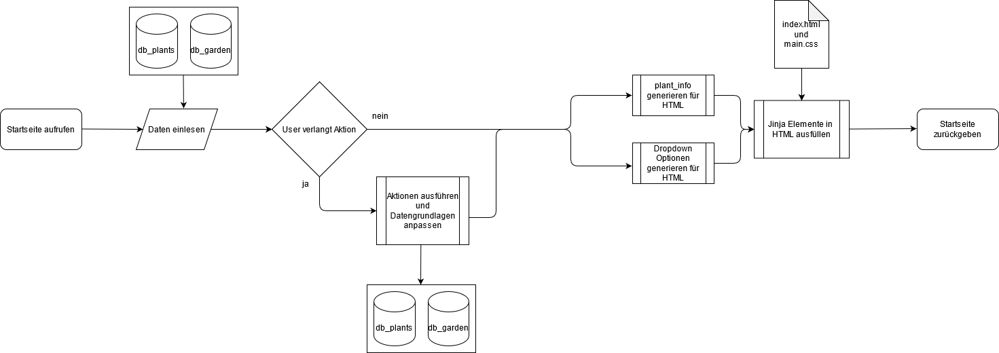

# Meine Pflanzen

## Ausgangslage
Beim hegen und pflegen unserer Pflanzen passiert es all zu schnell, dass wir uns fragen:
> *Wann muss ich die Pflanze das nächste mal giessen?*
> *Wie oft muss ich sie schon wieder giessen?* 

Die Web-App "Meine Pflanzen" kann bei der Beantwortung weiterhelfen.

## Projektidee und Funktion
Die Meine Pflanzen App soll helfen, die Wässerungs-Bedürfnisse beliebig vieler eigener Pflanzen im Blick zu behalten. Die App soll eine Übersicht zu den eigenen Pflanzen geben (mit Name, Art, idealer Giesshäufigkeit für jede Pflanzenart und Giess-Countdown) sowie Aktionen ermöglichen wie den Giess-Countdown zurückzusetzten und die eigenen Pflanzen sowie Pflanzentypen individuell zu verwalten.

## Workflow

○ Dateneingabe
Durch Benutzer

○ Datenverarbeitung/Speicherung
generator.py, actions.py, json dateien

○ Datenausgabe
in HTML mit Jinja

## Benutzeranleitung
Das Pflanzenverwaltungs-Tool muss lokal gespeichert und mit einem Python-Editor geöffnet werden. Dabei sind folgende Installationen notwendig:
- `Python 3.6`
- `Flask`
- `Jinja2`

Die App wird mit der Ausführung von main.py gestartet und läuft solange auf http://127.0.0.1:5000/. 

Für das Neu-Laden der Seite lieber Ctrl
Bei der Verwaltung der Pflanzentypen darf der Typ unbekannt nicht gelöscht werden, da er als default Inhalt für jede neue Pflanze dient. Es darf auch kein Pflanzen-Typ gelöscht werden solange unter "Meine Pflanzen" noch eine davon vorhanden ist.