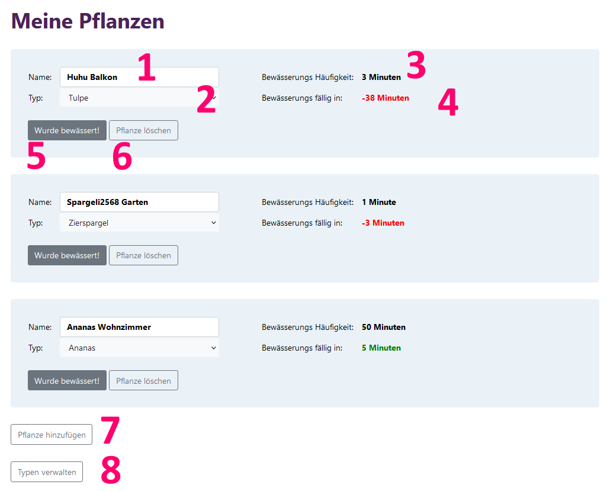
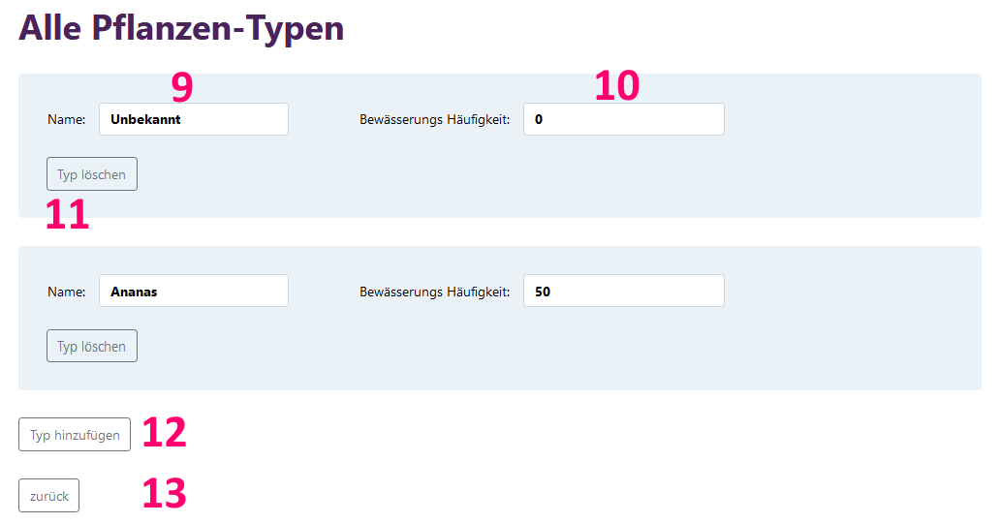

# Meine Pflanzen

## Ausgangslage
Beim hegen und pflegen unserer Pflanzen passiert es all zu schnell, dass wir uns fragen:
> *Wann muss ich die Pflanze das nächste mal giessen?*
> *Wie oft muss ich sie schon wieder giessen?* 

Die Web-App "Meine Pflanzen" kann bei der Beantwortung weiterhelfen.

## Projektidee und Funktion
Die Meine Pflanzen App soll helfen, die Wässerungs-Bedürfnisse beliebig vieler eigener Pflanzen im Blick 
zu behalten. Die App soll eine Übersicht zu den eigenen Pflanzen geben (mit Name, Art, idealer Giesshäufigkeit 
für jede Pflanzenart und Giess-Countdown). Ausserdem ermöglicht sie Aktionen wie den Giess-Countdown 
zurückzusetzten sowie die eigenen Pflanzen und den Pflanzentypen individuell zu verwalten.

## Benutzeranleitung
Das Pflanzenverwaltungs-Tool muss lokal gespeichert und mit einem Python-Editor geöffnet werden. Dabei 
sind folgende Installationen notwendig:
- `Python 3.6`
- `Flask`
- `Jinja2`

Die App wird mit der Ausführung von main.py gestartet und läuft solange auf http://127.0.0.1:5000/. 

Auf der Hauptseite "Meine Pflanzen" sind alle Pflanzen aufgelistet und zwar nach deren Giessdringlichkeit. Zu jeder Pflanze gehört 
- ihr Name (1)
- der Pflanzentyp dem sie angehört (2)
- der empfohlenen Bewässerungshäufigkeit für diesen Typ (3)
- die verbleibende Zeit bis zum nächsten Giess-"Termin" in grün (Zeit übrig), orange (Giessen fällig) 
  oder rot (Zeit überschritten)
- der Button (5) um den Giess-Timer zurückzusetzen, nachdem gegossen wurde
- der Button (6) um eine Pflanze komplett aus der Auflistung zu löschen

Der Name ist durch Klicken ins Feld 1 frei und jederzeit modifizierbar. Der Pflanzentyp (2) kann aus 
einer Dropdown Auswahl der angebotenen Typen gewählt werden. Die Bewässerungshäufigkeit (3) hängt vom 
Pflanzentyp ab.

Durch "Pflanze hinzufügen" unten auf der Hauptseite (7), kann ein neues Pflanzenfeld hinzugefügt werden. 
Es beinhaltet default Angaben, die aber wie weiter oben beschrieben, modifizierbar sind.

"Typen verwalten" (8) führt zur Nebenseite "Alle Pflanzen-Typen".

Bei Bedarf können die in 2 aufgelisteten Typen auf dieser "Alle Pflanzen-Typen" Nebenseite verwaltet werden.
Die hier gemachten Änderungen werden auf der Hauptseite im Dropdown (2) und dementsprechend auch 3 und 4 reflektiert.
Der Aufbau ist ähnlich wie der der Hauptseite. Jeder verfügbare Typ ist aufgelistet und beinhaltet:
- Name (9)
- ideale Bewässerungs Frequenz (10)
- Button um den Typ zu löschen (11)

Der Name (9) und die Bewässerungs Häufigkeit (10) sind direkt im Textfeld modifizierbar, wobei in Textfeld 
10 nur Zahlen reingeschrieben werden dürfen.

Hier (12) kann bei Bedarf ein neuer Pflanzentyp hinzugefügt werden und der "zurück" Button (13) führt 
nach der gewünschten Bearbeitung wieder zur Hauptseite.

Zu beachten ist, dass bei der Verwaltung der Pflanzentypen der Typ unbekannt nicht gelöscht werden darf, 
da er als default Inhalt für jede neue Pflanze dient. Es darf auch kein Pflanzen-Typ gelöscht werden 
solange unter "Meine Pflanzen" noch eine davon vorhanden ist.

## Workflow
In diesem Flow-Chart ist der Prozess der App grob dargestellt. Es zeigt, wie man vom Aufruf der Webseite 
zur geladenen Seite gelangt.

Als erstes werden die zwei Datengrundlagen geladen und zwar alle meine Pflanzen (db_garden.json) und 
alle möglichen Planzentypen (db_plants.json).

Der Nächste Schritt hängt davon ab, ob der User eine Aktion angefordert hat (POST). Die möglichen Aktionen 
sind weiter oben im Kapitel Benutzeranleitung erläutert. Fordert der User eine Aktion auf, so bekommt 
main.py durch POST request die Art der Aktion und die zugehörigen Infos (z.B. den neuen Namen) mitgeteilt.
Damit wird mit Funktionen aus actions.py die Datengrundlage angepasst und gespeichert. 
Fordert der User keine Aktion (GET), wird dieser Schritt übersprungen.

Nun muss mittels Funktionen aus generator.py die Datengrundlage etwas umgewandelt werden, damit sie 
einfacher von Jinja gelesen werden kann.
So braucht Jinja eine Liste mit auswählbaren Pflanzentypen für die Dropdown-Auswahl (2) und eine Liste
mit den darzustellenden Pflanzeninfos (1, 2, 3, 4).
Hier wird auch die verbleibende Zeit bis zum nächsten Giessen berechnet, eingefärbt und die Pflanzen 
nach verbleibender Zeit sortiert.

Der Letzte Schrittbesteht darin, die zuvor genannten Daten dank Jinja Syntax in das index.html einzufügen.
Das Resultat davon wird an den Browser des Benutzer geschickt. 

Für die Hauptseite (Meine Pflanzen) und die Nebenseite (Alle Pflanzen-Typen) ist der Work-Flow grundsätzlich 
gleich, weswegen auf eine separate Aufführung verzichtet wird.

Achtung: Die Zeitangaben sind absichtlich in Minuten gehalten, damit die Funktionsweisen schneller
überprüft werden können. Für eine realitätsgetreue Nutzung müsste in generator.py der Wasser-Countdown 
angepasst werden.